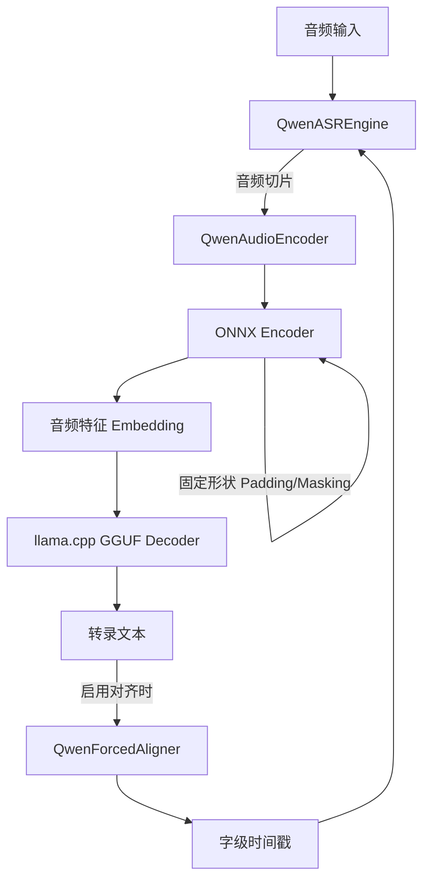

# Qwen3-ASR GGUF

**A卡不要用ROCM，比vulkan还慢！！！**

将 [Qwen3-ASR](https://www.modelscope.cn/collections/Qwen/Qwen3-ASR) 模型转换为可本地高效运行的混合格式，实现**快速、准确的离线语音识别**。

主要依赖 [llama.cpp](https://github.com/ggml-org/llama.cpp) 加速 LLM Decoder。

Qwen3-ASR 0.6B 与 Qwen3-ASR 1.7B 以及 Qwen3-ForceAligner 0.6B 均可用，

修复了重复出现英文不重试的问题。增加文本过长检测并截断，以及fp16准确率确实有提升。


### 核心特性

- ✅ **纯本地运行** - 无需网络，数据不外传
- ✅ **速度快** - 混合推理架构 (ONNX Encoder + GGUF Decoder)
- ✅ **GPU 加速** - 支持 Vulkan / DirectML 
- ✅ **流式输出** - 无限时长的音频文件，流式转录
- ✅ **字幕输出** - ForceAligner 对齐字级时间戳，输出 SRT/JSON 格式
- ✅ **上下文增强** - 可提供上下文信息，提升准确率


## 性能表现

**A卡不要用ROCM，比vulkan还慢！！！**


1.7B 在 RX 7900 XT (vulkan)上的实测数据（约2小时中文直播音频）：

```
╭────────────── Qwen3-ASR 配置选项 ───────────────╮
│  模型目录    D:\ai\Qwen3-ASR-GGUF\model         │
│  编码精度    fp16                               │
│  加速设备    ONNX:DML | LLM-GPU:ON | Vulkan:ON  │
│  时间戳对齐  启用                               │
│  语言设定    自动识别                           │
╰─────────────────────────────────────────────────╯
--- [QwenASR] 初始化引擎 (Provider: DML) ---
--- [Encoder] 加载 Split ONNX 模型 (Provider: DmlExecutionProvider, Pad: 40s) ---
    Frontend: qwen3_asr_encoder_frontend.fp16.onnx
    Backend:  qwen3_asr_encoder_backend.fp16.onnx
--- [Encoder] 正在预热 (固定形状: 40s)... ---
--- [Encoder] 预热完成 ---
--- [QwenASR] 引擎初始化耗时: 4.14 秒 ---

...

📊 性能统计:
  🔹 RTF (实时率) : 0.022 (越小越快)
  🔹 音频时长    : 7219.18 秒
  🔹 总处理耗时  : 158.24 秒
  🔹 对齐耗时    : 21.526 秒
  🔹 编码耗时    : 11.835 秒
  🔹 LLM 预填充  : 17.930 秒 (205694 tokens, 11472.0 tokens/s)
  🔹 LLM 生成    : 102.702 秒 (15651 tokens, 152.4 tokens/s)
✅ 已保存文本文件: test.txt
✅ 已生成字幕文件: test.srt
✅ 已导出时间戳: test.json
```


1.7B 在 RX 7900 XT (ROCM)上的实测数据（约2小时中文直播音频）：

```
HIP Library Path: C:\WINDOWS\SYSTEM32\amdhip64_7.dll
╭────────────── Qwen3-ASR 配置选项 ───────────────╮
│  模型目录    D:\ai\Qwen3-ASR-GGUF\model         │
│  编码精度    fp16                               │
│  加速设备    ONNX:DML | LLM-GPU:ON | Vulkan:ON  │
│  时间戳对齐  启用                               │
│  语言设定    自动识别                           │
╰─────────────────────────────────────────────────╯
--- [QwenASR] 初始化引擎 (Provider: DML) ---
--- [Encoder] 加载 Split ONNX 模型 (Provider: DmlExecutionProvider, Pad: 40s) ---
    Frontend: qwen3_asr_encoder_frontend.fp16.onnx
    Backend:  qwen3_asr_encoder_backend.fp16.onnx
--- [Encoder] 正在预热 (固定形状: 40s)... ---
--- [Encoder] 预热完成 ---
--- [QwenASR] 引擎初始化耗时: 5.27 秒 ---

...

📊 性能统计:
  🔹 RTF (实时率) : 0.029 (越小越快)
  🔹 音频时长    : 7577.09 秒
  🔹 总处理耗时  : 217.42 秒
  🔹 对齐耗时    : 26.179 秒
  🔹 编码耗时    : 12.783 秒
  🔹 LLM 预填充  : 24.764 秒 (216200 tokens, 8730.3 tokens/s)
  🔹 LLM 生成    : 130.456 秒 (16194 tokens, 124.1 tokens/s)
✅ 已保存文本文件: test.txt
✅ 已生成字幕文件: test.srt
✅ 已导出时间戳: test.json
```

## 显存占用

以 1.7B ASR 和 0.6B Aligner 载入为例，Encoder fp16，Decoder fp16，总计约 10.2GB。


## 快速开始

### 1. 安装依赖

```bash
pip install onnxruntime-directml pydub numpy scipy gguf srt
```

转换格式还需要：

```bash
pip install torch transformers==4.57.6
```

> `pydub` 需要系统安装 [ffmpeg](https://ffmpeg.org/download.html)
> 
> 依赖可能写得不是那么全，缺啥就装啥呗，没有需要自己编译的

从 [llama.cpp Releases](https://github.com/ggml-org/llama.cpp/releases) 下载预编译二进制，将 DLL 放入 `qwen_asr_gguf/bin/`：

| 平台 | 下载文件 |
|------|----------|
| **Windows** | `llama-bXXXX-bin-win-按照自己显卡选择-x64.zip` |

### 2. 下载模型


#### 2.1 下载模型

到 [Models Release](https://huggingface.co/lingxues/Qwen3-ASR-GGUF-fp16) 下载已经转换好的模型打包文件，下载后解压到 `model` 文件夹。

如果处于互联网受限情况可使用 [hf-mirror](https://hf-mirror.com) 进行下载

ASR 模型是 1.7B 的。

Aligner 模型是 0.6B 的。

打包的模型：

- Encoder 全部 fp16 精度
- Decoder 全部 fp16 精度

如果执意要用其它精度（fp32、int8、int4）可以自行手动导出。


#### 2.2 手动导出

下载原始模型：

```bash
pip install modelscope
modelscope download --model Qwen/Qwen3-ASR-1.7B
modelscope download --model Qwen/Qwen3-ForcedAligner-0.6B
```

配置 `export_config.py`，定义官方模型路径、导出路径：

```python
from pathlib import Path
model_home = Path('~/.cache/modelscope/hub/models/Qwen').expanduser()

# [源模型路径] 官方下载好的 SafeTensors 模型文件夹
ASR_MODEL_DIR =  model_home / 'Qwen3-ASR-1.7B'
ALIGNER_MODEL_DIR =  model_home / 'Qwen3-ForcedAligner-0.6B'

# [导出目标路径] 转换后的 ONNX, GGUF 和权重汇总目录
EXPORT_DIR = r'./model'

```

导出模型：

```bash
# === 1. ASR 模型导出流程 ===
python 01-Export-ASR-Encoder-Frontend.py     # 导出 Encoder 前段 (CNN)
python 02-Export_ASR-Encoder-Backend.py      # 导出 Encoder 后段 (Transformer)
python 03-Optimize-ASR-Encoder.py            # 优化 ONNX 模型
python 04-Quantize-ASR-Encoder.py            # 编码器量化 (FP16/INT8/INT4)
python 05-Export-ASR-Decoder-HF.py           # 提取 Decoder 权重
python 06-Convert-ASR-Decoder-GGUF.py        # 转为 GGUF 格式 (FP16)
python 07-Quantize-ASR-Decoder-GGUF.py       # GGUF 二次量化 (Q4_K)

# === 2. Aligner 模型导出流程 ===
python 11-Export-Aligner-Encoder-Frontend.py
python 12-Export-Aligner-Encoder-Backend.py
python 13-Optimize-Aligner-Encoder.py
python 14-Quantize-Aligner-Encoder.py
python 15-Export-Aligner-Decoder-HF.py
python 16-Convert-Aligner-Decoder-GGUF.py
python 17-Quantize-Aligner-Decoder-GGUF.py
```

### 3. 转录测试

推荐使用 `transcribe.py` 命令行工具进行转录，支持丰富的参数配置：

```bash
# 基本用法
python transcribe.py test.mp3

# 添加参数，如指定精度和上下文大小
python transcribe.py test.mp3 --prec fp16 --n-ctx 4096
```

也可以参考 `21-Run-ASR.py` 在 Python 代码中调用：

```bash
python 21-Run-ASR.py
```

部分代码解析：

```python
# 配置引擎
config = ASREngineConfig(
    model_dir="model", 
    use_dml = True, 
    encoder_frontend_fn = "qwen3_asr_encoder_frontend.fp16.onnx",
    encoder_backend_fn = "qwen3_asr_encoder_backend.fp16.onnx",
    enable_aligner = True, 
    align_config = AlignerConfig(
        use_dml=True, 
        model_dir="model", 
        encoder_frontend_fn = "qwen3_aligner_encoder_frontend.fp16.onnx",
        encoder_backend_fn = "qwen3_aligner_encoder_backend.fp16.onnx"
    )
)

# 初始化引擎
engine = QwenASREngine(config=config)

# 执行转录
res = engine.transcribe(
    audio_file=audio_path,  
    context=context,
    language="Chinese",   # 强制指定语言 (如 'Chinese', 'English', None)
    start_second=0,       # 从何处开始读音频
    duration=None         # 读取多长音频，None 表示全部读取
)

```

项目采用**纯同步顺序执行**架构，得益于 Encoder 在开启 DirectML 后的极速表现（30s 音频仅需约 0.04s），现已移除复杂的多进程异步流水线，简化为：



- **同步执行**: `编码 -> LLM 推理 -> 对齐` 顺序完成，代码更简洁，RTF 依然保持领先。
- **DML 形状固定优化**: 推理时将音频填充（Padding）到固定长度（如 40s），并配合 Attention Mask。这解决了 DirectML 在处理动态形状时频繁分配显存导致的性能抖动，显著提升了推理速度。


## 项目结构

```bash
├── 01-Export-ASR-Encoder-Frontend.py        # 导出 ASR 编码器前段 (CNN)
├── 02-Export_ASR-Encoder-Backend.py         # 导出 ASR 编码器后段 (Transformer)
├── 03-Optimize-ASR-Encoder.py               # 优化 ASR 编码器 (融合常量、折叠算子)
├── 04-Quantize-ASR-Encoder.py               # ASR 编码器量化 (INT8/FP16/INT4)
├── 05-Export-ASR-Decoder-HF.py              # 提取 ASR 解码器权重
├── 06-Convert-ASR-Decoder-GGUF.py           # ASR 解码器转为 GGUF 格式 (FP16)
├── 07-Quantize-ASR-Decoder-GGUF.py          # ASR 解码器 GGUF 量化 (Q4_K)
├── 11-Export-Aligner-Encoder-Frontend.py    # 导出对齐编码器前段
├── 12-Export-Aligner-Encoder-Backend.py     # 导出对齐编码器后段
├── 13-Optimize-Aligner-Encoder.py           # 优化对齐编码器
├── 14-Quantize-Aligner-Encoder.py           # 对齐编码器量化 (INT8/FP16/INT4)
├── 15-Export-Aligner-Decoder-HF.py          # 提取对齐解码器权重
├── 16-Convert-Aligner-Decoder-GGUF.py       # 将对齐解码器转换为 GGUF
├── 17-Quantize-Aligner-Decoder-GGUF.py      # 对齐解码器 GGUF 量化
├── 18-Run-Aligner.py                        # Aligner 对齐 API 示例脚本
├── 21-Run-ASR.py                            # ASR 转录 API 示例脚本
├── transcribe.py                            # 命令行转录工具 (功能最全)
├── asr.bat                                  # 把文件拖过去就可以运行了
└── qwen_asr_gguf/
    └── inference/
        ├── asr.py                  # ASR 核心引擎逻辑
        ├── aligner.py              # 强行对齐逻辑
        ├── encoder.py              # 音频特征提取逻辑 (ONNX 封装)
        ├── llama.py                # llama.cpp Python 绑定
        ├── exporters.py            # SRT/JSON/TXT 导出工具
        └── chinese_itn.py          # 中文数字规整 (ITN)
```

## 常见问题

**Q: 输出全是乱码或「!!!!」怎么办？**

Intel 集显的 FP16 计算可能溢出，设置环境变量禁用：

```python
os.environ["GGML_VK_DISABLE_F16"] = "1"
```


---

## 致谢

- [Qwen3-ASR](https://www.modelscope.cn/collections/Qwen/Qwen3-ASR) - 原始模型
- [llama.cpp](https://github.com/ggml-org/llama.cpp) - GGUF 推理引擎
